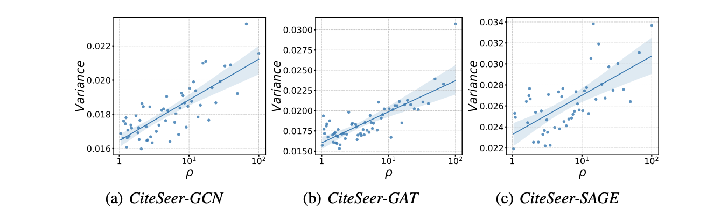
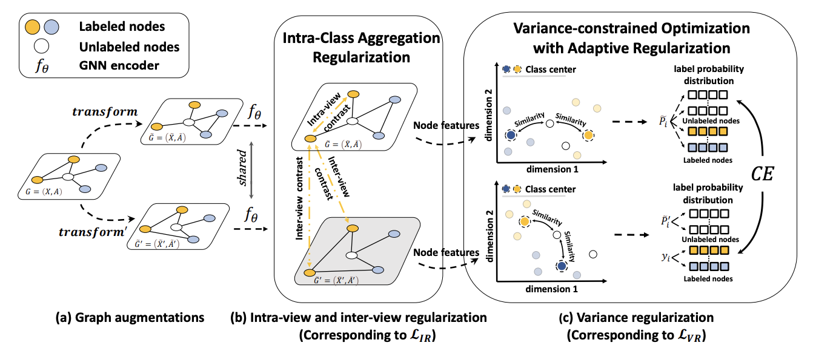

# Rethinking Semi-Supervised Imbalanced Node Classification from Bias-Variance Decomposition (NeurIPS 2023).

## Introduction

Official Pytorch implementation of NeurIPS 2023 paper "[Rethinking Semi-Supervised Imbalanced Node Classification from Bias-Variance Decomposition](https://arxiv.org/abs/2310.18765)"



This paper introduces a new approach to address the issue of class imbalance in graph neural networks (GNNs) for learning on graph-structured data. Our approach integrates imbalanced node classification and Bias-Variance Decomposition, establishing a theoretical framework that closely relates data imbalance to model variance. We also leverage graph augmentation technique to estimate the variance, and design a regularization term to alleviate the impact of imbalance. This work provides a novel theoretical perspective for addressing the problem of imbalanced node classification in GNNs.

## The Implementation of Baselines and the Configuration of Hyperparameters
- For the implementation and hyperparameters setting of **Re-Weight, PC Softmax, BalancedSoftmax, TAM**, please refer to [TAM](https://github.com/Jaeyun-Song/TAM).
- For the implementation and hyperparameters setting of **GraphSmote**, please refer to [GraphSmote](https://github.com/TianxiangZhao/GraphSmote).
- For the implementation and hyperparameters setting of **Renode**, please refer to [Renode](https://github.com/victorchen96/ReNode).
- For the implementation and hyperparameters setting of **GraphENS**, please refer to [GraphENS](https://github.com/JoonHyung-Park/GraphENS).

We strictly adhere to the hyperparameter settings as specified in these papers. For detailed information, please refer to the respective publications.


## Semi-Supervised Node Classification (Public Split)

The code for semi-supervised node classification. 
This is implemented mainly based on [Pytorch Geometric](https://github.com/rusty1s/pytorch_geometric). 


## Semi-Supervised Node Classification (Random Split)

## Configuration
All the algorithms and models are implemented in Python and PyTorch Geometric. Experiments are
conducted on a server with an NVIDIA 3090 GPU (24 GB memory) and an Intel(R) Xeon(R) Silver
4210R CPU @ 2.40GHz.

## Citation
```
@inproceedings{
yan2023rethinking,
title={Rethinking Semi-Supervised Imbalanced Node Classification from Bias-Variance Decomposition},
author={Divin Yan and Gengchen Wei and Chen Yang and Shengzhong Zhang and Zengfeng Huang},
booktitle={Thirty-seventh Conference on Neural Information Processing Systems},
year={2023},
url={https://openreview.net/forum?id=0gvtoxhvMY}
}
```

## Acknowledgement
This work is supported by National Natural Science Foundation of China No.U2241212, No.62276066. We extend our gratitude to Jaeyun-Song for their meticulous organization of the baselines implementation within the [TAM framework](https://github.com/Jaeyun-Song/TAM).
